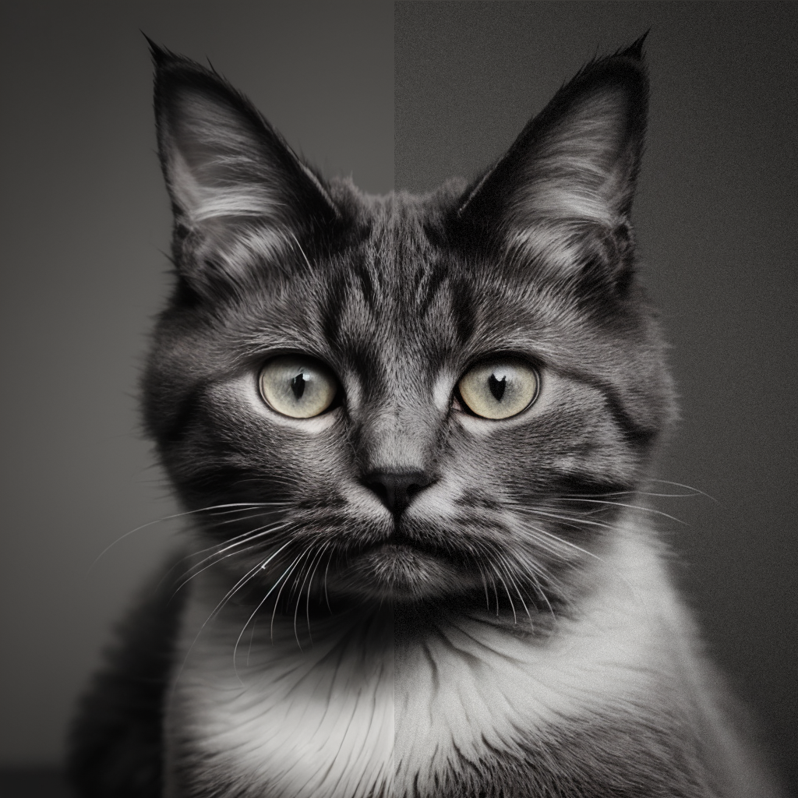

# SD Film Grain Noise

A custom script for Automatic1111 stable diffusion web ui that adds a variable amount of noise/film grain to images to help disguise some of the too-clean lines sometimes present in especially upscaled images.

## Installation

Download film_grain.py and drop it into the scripts folder in the webui

## Usage

Select "Add Film Grain" from the scripts dropdown on text2img or img2img - set desired noise. I find 5-10 looks good. 0 is none, 100 is all noise.

## Contributing

Find a bug, want a feature? Feel free to open a PR.

## License

MIT
